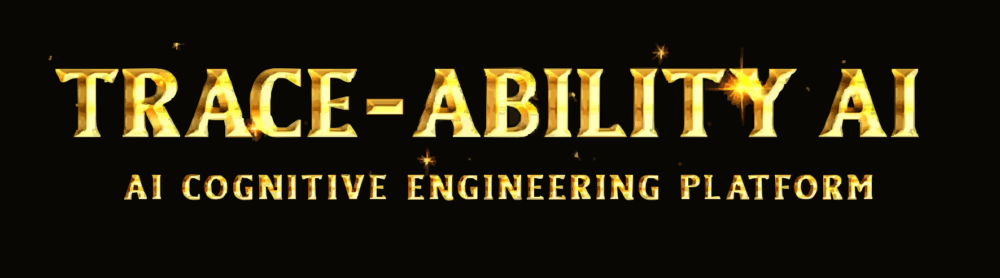

<p align="center">
  
</p>

<br>

<p align="center">
  
  &nbsp;&nbsp;
  
  &nbsp;&nbsp;
  
  &nbsp;&nbsp;
  
</p>

<p align="center">
  
  &nbsp;
  
</p>

---

## 🔍 TRACE-ABILITY AI

**Trace-Ability AI** is a cognitive observability platform that captures developer intent from raw Git telemetry and converts it into structured intelligence logs. The system acts like a software flight recorder, preserving reasoning history, architecture evolution, and risk signals using cloud AI inference.

---

## 🧠 CORE INTELLIGENCE VECTORS

| Vector | Capability |
|---|---|
| Semantic Diff Intelligence | Structural understanding of code mutations |
| Intent Reconstruction | Converts logic changes into human-readable reasoning |
| Stability Risk Analysis | Automated complexity and breaking-change detection |
| Architecture Evolution Mapping | Tracks system design progression |
| Trust Validation Matrix | Confidence verification across AI outputs |

---

## ⚡ ENGINEERING PROPERTIES

• Zero-touch developer documentation  
• Deterministic trust scoring system  
• Agentic pipeline monitoring  
• Secure cloud reasoning execution  

---

## 🏗️ INTELLIGENCE PIPELINE

| Stage | Operation |
|---|---|
| Telemetry Capture | Dual-source: Local hooks + GitHub Webhooks |
| Cloud Ingestion | Secure API transport via AWS Lambda Function URLs |
| Reasoning Core | LLM inference using Amazon Nova Lite v1 |
| Cognitive Scoring | Trust + risk quantification |
| Persistence Layer | Structured storage logging (DynamoDB) |
| Narrative Output | Automatic GitHub Commit Comments + Web Dashboard |

---

## 📐 TRUST VALIDATION MODEL

$$
TrustScore = \frac{(\sqrt{Confidence} \times 0.6) + (\sqrt{Alignment} \times 0.4)}{10}
$$

### Risk Zones
| Score | State |
|---|---|
| 0 - 30 | Stable |
| 31 - 70 | Moderate Change |
| 71 - 100 | Critical Mutation |
---

## 📡 REASONING TELEMETRY SAMPLE

```json
{
  "summary": "Optimized database memory allocation",
  "intent": "Reduced heap pressure using context-managed buffer streams",
  "risk_score": 14,
  "confidence_score": 97.9,
  "category": "Performance Optimization",
  "trust_score": 9.8,
  "timestamp": "2026-03-01T12:00:00Z"
}
```
## 🧱 SYSTEM STRUCTURE

```
Trace-Ability/
├── README.md
├── assets
│   └── Header.svg
├── backend
│   └── lambda_handler.py      # Multi-purpose AI Reasoning Engine
├── data
│   └── schema.json
├── design.md
├── hooks
│   └── pre-commit.py    # Client-side diff automation
├── requirements.md       # Architectural requirements
├── requirements.txt      # Dependency manifest
└── tests
    ├── github_api_test.py     # Integration verification script
    └── sample_diff.json   # Standardized test payloads

```
---

## 🔗 INTEGRATION ECOSYSTEM

Trace-Ability is no longer just a passive observer. It is now a **bidirectional intelligence agent** that interacts directly with the developer's environment.

| Integration | Mechanism | Outcome |
|---|---|---|
| **GitHub Webhooks** | Event-driven push triggers | Serverless execution on every code push |
| **GitHub REST API** | Automated Commit Commenting | AI injects reasoning directly into the Git history |
| **Local Git Hooks** | Pre-commit diff interception | Instant feedback before code leaves the machine |
| **Cloud Dashboard** | Real-time Telemetry UI | Visualized architectural evolution and risk heatmaps |

---

## 🛠️ DESIGN PHILOSOPHY

Built using spec-driven intelligence engineering.

• EARS-style requirement modeling  
• Async inference latency management  
• High-volume diff stream processing  

## 🚀 FUTURE ROADMAP

| Phase | Goal |
|---|---|
| IDE Integration | VS Code & JetBrains extensions |
| Knowledge Synthesis | Team logic visualization |
| Offline AI Mode | Local inference support |

## 🎓 HACKATHON VALUE

Designed for developer productivity and AI-assisted learning environments.  
The system reduces documentation debt by automatically generating semantic intent summaries from code activity.

## 🚀 DEPLOYMENT

The entire intent-extraction pipeline was built and deployed with a fully serverless architecture. End-to-end development, testing, and deployment consumed roughly $0.01 of cloud cost, demonstrating extreme cost efficiency and scalability for production workloads.

---
```bash
git clone https://github.com/sohamrajput98/Trace-Ability.git
cd Trace-Ability

chmod +x hooks/pre_commit.py
ln -sf ../../hooks/pre_commit.py .git/hooks/pre-commit

# Configure AWS Bedrock credentials
# Enable Lambda + DynamoDB permissions
```
<p align="center">  </p>
