<p align="center">
  
</p>

<br>

<p align="center">
  
  &nbsp;&nbsp; 
  
  &nbsp;&nbsp;
  
  &nbsp;&nbsp;
  
</p>

<p align="center">
  
  &nbsp;&nbsp;
  
</p>

---

## 🌐 LIVE NEURAL INTERFACE

<p align="center">
  <a href="https://trace-ability-io6r.vercel.app/">
    
  </a>
</p>

> [!IMPORTANT]  
> ## 🎥 SYSTEM TELEMETRY NOTE (DEMO VIDEO)
> Due to the initial cold-start handshake and telemetry ingestion, the video stream appears inactive for the first **38 seconds**. **Technical reasoning, live logs, and the dashboard deep-dive begin at exactly 00:38.**
> 
> <p align="center"> <h3><p align="center"><a href="https://1drv.ms/v/c/db6afeda21cc0776/IQAnoWG3PAzcSYCgVQBOcLBnAblpMPykOua0ok8pkBUinV8?e=R9Uz3K"><b><font color="#FFD700">▶ WATCH THE SYSTEM DEMO HERE</font></b></a></p></h3> 

<br>

# 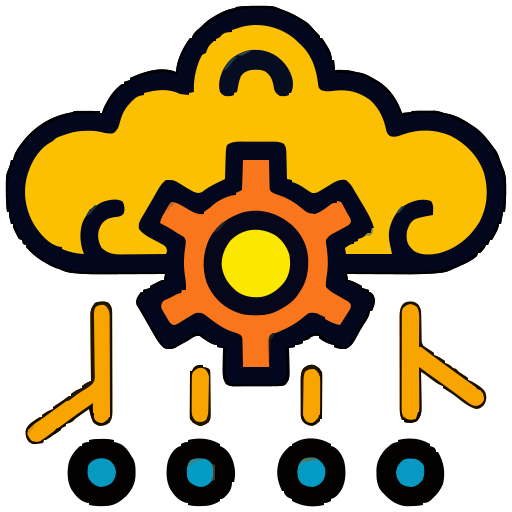 TRACE-ABILITY SYSTEMS
**The Cognitive Black Box Recorder for Software Architecture.** Trace-Ability intercepts developer commits, reconstructs the architectural intent behind every code change, and preserves it as immutable telemetry. ---

##  THE "CONTEXT COLLAPSE" ANOMALY

| The Flaw | The Catalyst | The Reality |
| :--- | :--- | :--- |
| **Git tracks *what* changed, but erases the *why*.** | **AI accelerates code generation without capturing intent.** | **Endless hours wasted reverse-engineering massive technical debt.** |

Six months later, developers cannot explain why a critical service dependency was introduced . Trace-Ability bridges this gap by generating living, evolving documentation natively through semantic analysis, avoiding reliance on misleading or incomplete human commit messages .

---

## 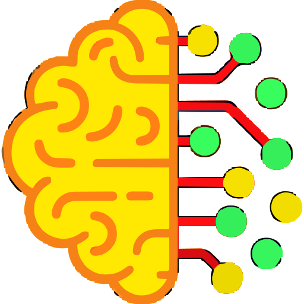 THE TRACE-ABILITY SOLUTION

Trace-Ability uses Amazon Nova Lite to analyze raw code diffs and reconstruct the architectural intent behind each commit . 

* **Automated Intent Reconstruction:** Semantic analysis of code diffs to generate living, evolving documentation .
* **Immutable Telemetry Ledger:** Cryptographically secure log of all project intelligence stored in Amazon DynamoDB .
* **Cognitive Value Add:** Generates Trust Scores and Risk Metrics, converts complex diffs into clear executive summaries, and reduces code-review cognitive load for developers .

---

## 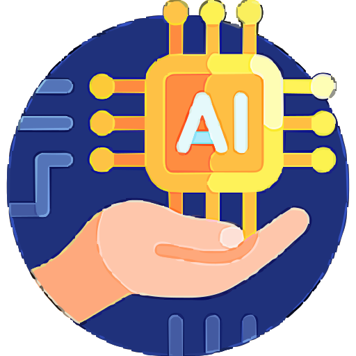 THE DETERMINISTIC TRUST MODEL

To eliminate the "Black-Box" uncertainty of standard AI wrappers, Trace-Ability assigns a deterministic score to AI outputs based on three core vectors . 

$$Trust = Model Confidence  \times  Diff Consistency  \times  Change Locality$$ 

* **Model Confidence:** The LLM probability score for the generated architectural narrative .
* **Diff Consistency:** Structural alignment between the human commit message and actual code changes .
* **Change Locality:** Evaluates whether modifications are tightly concentrated within a logical module or scattered .

---

## 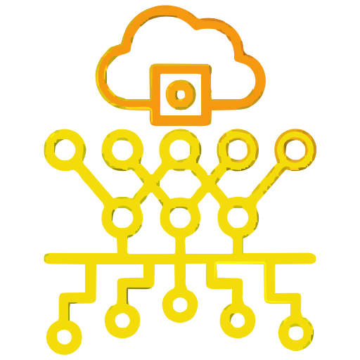 SYSTEM ARCHITECTURE

Trace-Ability operates on an event-driven CI pipeline built on GitHub Actions and powered by AWS Serverless technologies .

<p align="center">
  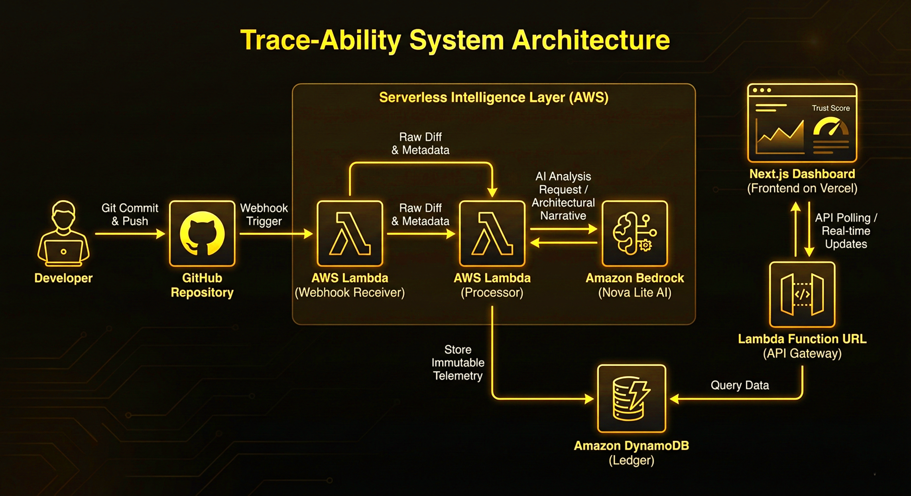
  <br>
  <i><font color="#FFCC00" size="3">Figure 1.0: End-to-End Serverless Intelligence Layer</font></i>
</p>

### Architecture Components
* **GitHub Repository:** The entry point where Git Commit & Push events trigger the webhook .
* **AWS Lambda (Webhook Receiver & Processor):** Processes commit events from GitHub Actions, handling raw diffs and metadata .
* **Amazon Bedrock (Nova Lite AI):** Performs the semantic reasoning and AI Analysis Request to generate the Architectural Narrative .
* **Amazon DynamoDB (Ledger):** Stores the immutable telemetry and results as an architectural ledger .
* **Next.js Dashboard:** Frontend on Vercel that queries data via Lambda Function URLs (API Gateway) to display the Trust Score and real-time updates .

---

## 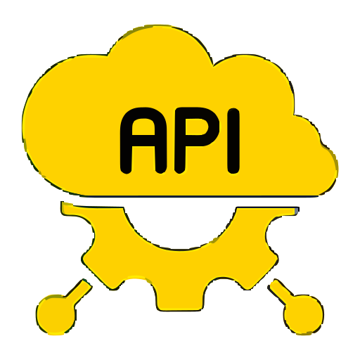 HIGH-LEVEL PROCESS FLOW

<p align="center">
  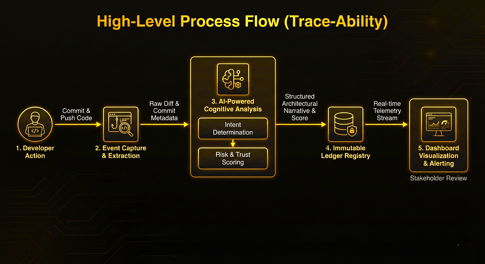
  <br>
  <i><font color="#FFCC00" size="3">Figure 1.1: Multi-Stage Telemetry Ingestion and Agentic Reasoning Flow</font></i>
</p>

### The 5-Stage Pipeline
1. **Developer Action:** A developer commits and pushes code to the repository .
2. **Event Capture & Extraction:** Raw diff and commit metadata are intercepted and extracted .
3. **AI-Powered Cognitive Analysis:** The system performs intent determination and risk & trust scoring .
4. **Immutable Ledger Registry:** The structured architectural narrative and score are stored securely .
5. **Dashboard Visualization & Alerting:** A real-time telemetry stream is sent to the dashboard for stakeholder review .

---

##  EVALUATION / RESULTS

The intent-extraction pipeline was built and deployed using a fully serverless architecture to ensure extreme scale-to-zero efficiency .

* **Cost Optimization:** Transitioned the intelligence engine to Amazon Nova Lite, resulting in an MVP estimated cost of < $10/month . End-to-end development, testing, and deployment consumed ~$0.01 in total cloud cost .
* **Semantic Accuracy:** Tested against a ground-truth dataset of 50 complex commits, achieving an 81.4% semantic match rate between the LLM's narrative and human intent .
* **Inference Latency:** Achieved < 3.5 seconds average intent-extraction time, allowing seamless CI/CD integration without blocking workflows .
* **Scale & Complexity:** Successfully processed an average diff size of 8-25 files per commit, with the largest test processing 42 files .

---

## 🚀 TECHNOLOGIES UTILIZED

| Category | Stack |
| :--- | :--- |
| **Cloud Compute & API** | AWS Lambda, Lambda Function URLs |
| **Generative AI** | Amazon Bedrock (Amazon Nova Lite) |
| **Database** | Amazon DynamoDB (with secured IAM least-privilege Scan/Query policies) |
| **Frontend Framework** | Next.js 15 (App Router), React, Tailwind CSS |
| **Animations & UI** | Framer Motion (Shared Layout Transitions, 3D Horizon Scrolling), Lucide Icons |
| **DevOps & Deployment** | Vercel (Custom Root Directory configs), GitHub Actions/Webhooks |

---

## 📸 SYSTEM TELEMETRY (DASHBOARD)

<p align="center">
  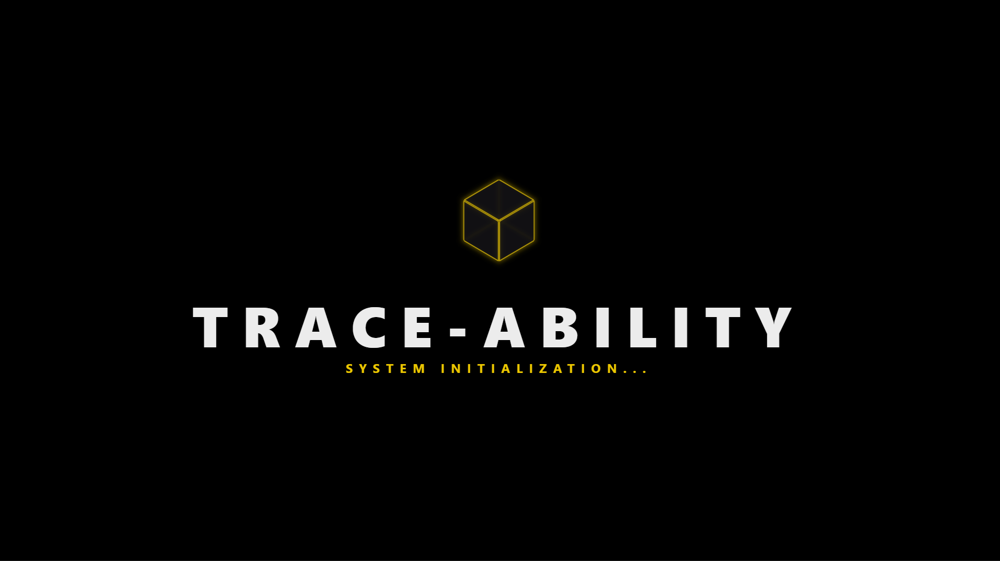<br>
 <br> <i> FIGURE 1:Operational Command Center: Real-time Cognitive Engineering HUD  </i>
<br>
  <br>
  <p align="center">
  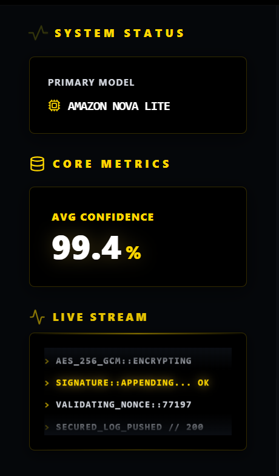
  &nbsp;&nbsp;&nbsp;&nbsp;<i> 
  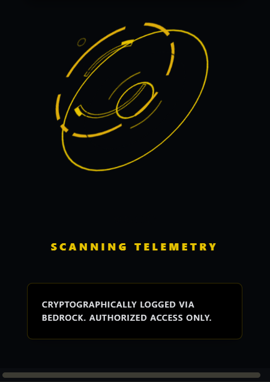
    <br> <i> FIGURE 2: Neural Intent Reconstruction </i>   &nbsp;&nbsp;&nbsp;&nbsp;&nbsp;&nbsp;&nbsp;&nbsp;  <i> FIGURE 3: Encrypted Telemetry Stream </i>
    <br><br>
</p>
</p>
<p align="center">
 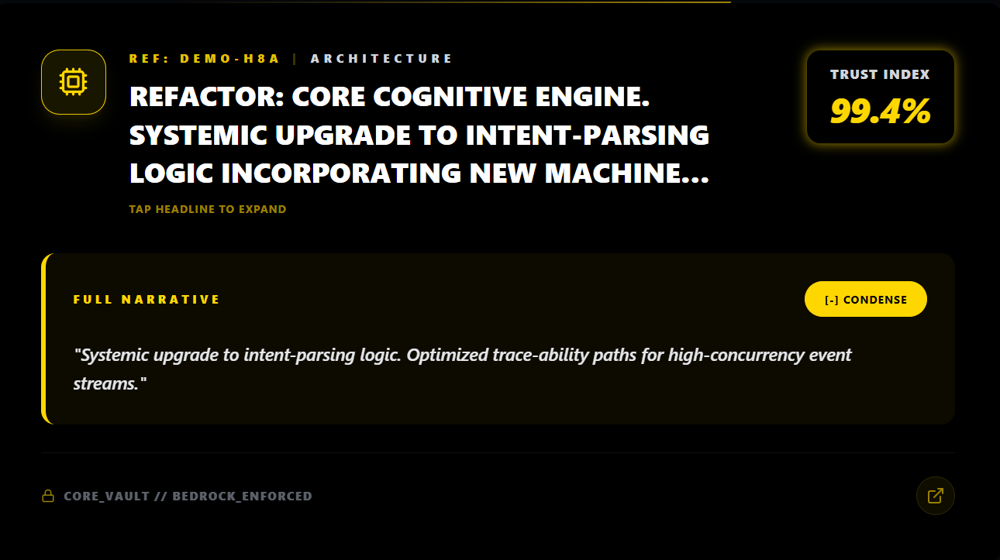<br>
  <i> FIGURE 4: System Initialization: Bedrock-Enforced Telemetry Scanning </i>
  <br>
  <br>
  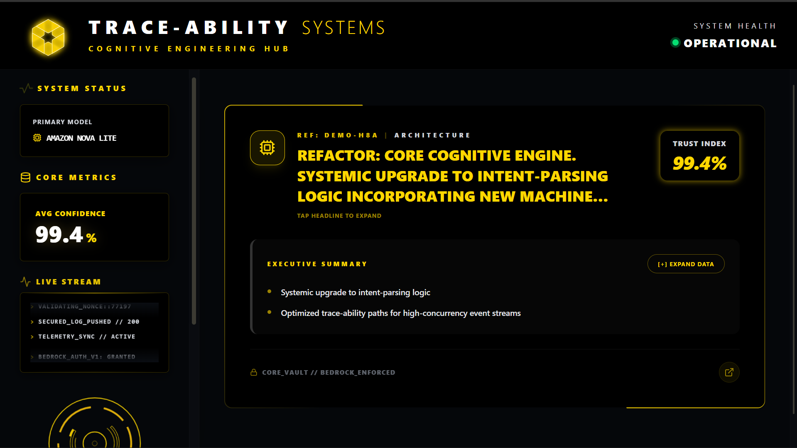<br><br>
  <i> FIGURE 5: Trace-Ability Core: Cognitive Black Box Recorder Branding </i>
</p>
  </i>
---

## 🧱 SYSTEM STRUCTURE

```text
[ INSERT YOUR TREE STRUCTURE HERE ]
```

 DEPLOYMENT & LOCAL SETUP
Because Trace-Ability utilizes AWS Lambda, it ensures you only pay for exact compute milliseconds during a git push .
```
Bash
# 1. Clone the repository
git clone [https://github.com/sohamrajput98/Trace-Ability.git](https://github.com/sohamrajput98/Trace-Ability.git)
cd Trace-Ability

# 2. Configure Local Webhooks
chmod +x hooks/pre_commit.py
ln -sf ../../hooks/pre_commit.py .git/hooks/pre-commit

# 3. Environment Provisioning
pip install -r requirements.txt
# Ensure AWS CLI is configured with Bedrock (Nova Lite) permissions
# Deploy backend/lambda_handler.py to AWS Lambda

```

 FUTURE IMPROVEMENTS
> Multi-Signal Context Aggregation: Expanding the pipeline to ingest Issue descriptions (Jira), PR discussions, and Slack threads alongside the code diff to generate a complete 360-degree view of developer intent .

> Pull Request Advisor: Injecting the Bedrock architectural narrative directly into GitHub PR comments as an automated reviewer before code merge .

> Semantic "Why" Search: Allowing developers to query the DynamoDB intent-registry (e.g., "Why did we introduce Redis to the auth service in January?") .

<p align="center">
<font color="#888888"><i>Architected with</i></font>


&nbsp;


</p>
